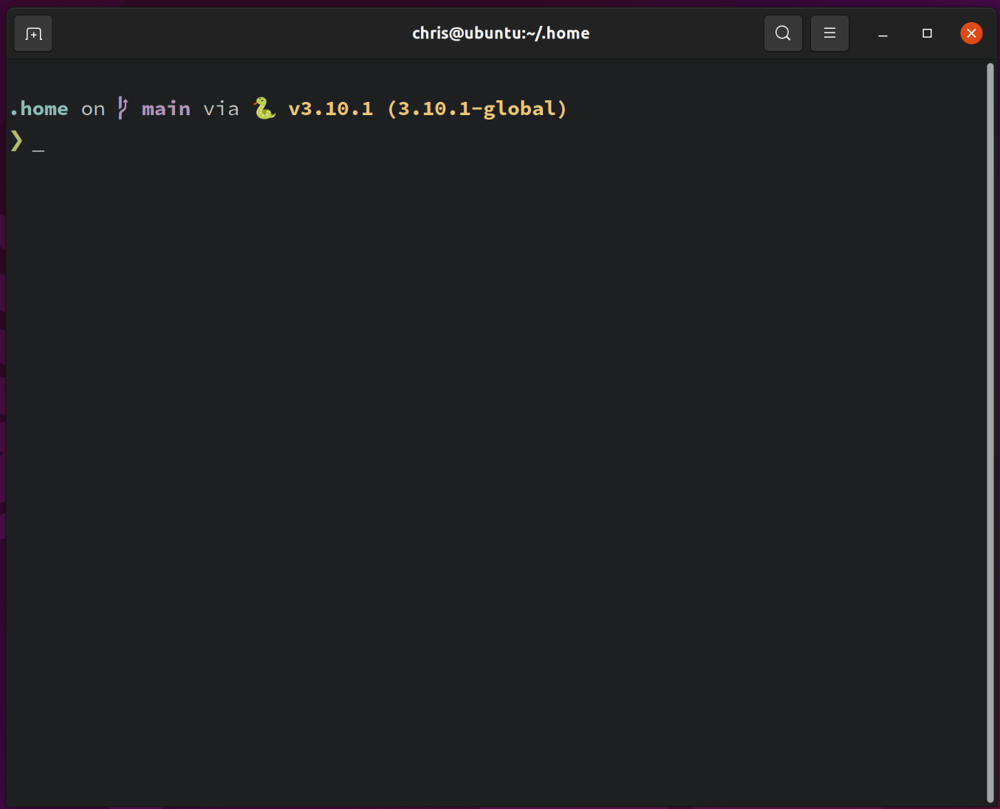
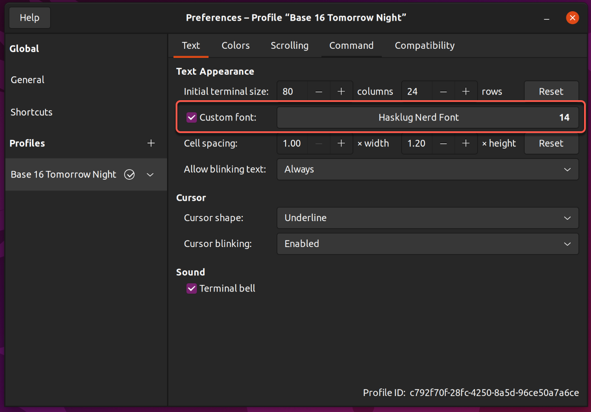

# :house: home

Version control and automatic management of user files in `$HOME`

## Overview

[home][] uses [GNU Stow][] and [Git][] to manage revision controlled files in your home directory (.dotfiles, scripts, etc). Stow is used to automatically maintain all the symbolic links in the user's `$HOME` directory that resolve to actual revision controlled files in the `HOME` directory of this repository.

In addition, there are some other goodies included (like my [Terminal.app](#macos-terminal-setup) profile for Mac).


## Motivation

I wanted to be able to keep track of all the random files that end up in my `$HOME` directories on the machines I work on. To avoid turning my `$HOME` directory into a repository itself, I needed to isolate these files in a subdirectory of my `$HOME` directory (i.e. `$HOME/.home`), but I didn't want to have to manually manage symbolic links between the two.  It turns out that [GNU Stow][] works perfectly for this type of thing, hence the dependency on Stow.

Obviously, you probably don't want to use my personal files "as is" on your own machine, so the idea with this repository is that it can serve as an example workflow that you can emulate or fork for your own purposes.


## Setup

1. Install `stow` (make sure to use a recent version that supports `--adopt`) and `git`

    ```bash
    # via Homebrew for Mac
    brew install stow git

    # via MacPorts for Mac
    sudo port install stow git

    # via apt for Ubuntu Linux
    sudo apt install stow git curl
    ```

2. Change to `$HOME` directory

    ```bash
    cd ~
    ```

3. Checkout this repository as `$HOME/.home`

    ```bash
    git clone --recurse-submodules git@github.com:cdwilson/home.git .home
    ```

4. Change to `.home` directory

    ```bash
    cd .home
    ```

5. Run `setup.sh` to install the git `post-commit` hook. This will also automatically create symlinks between the files in `$HOME/.home/HOME/` and your `$HOME` directory.  It will prompt for permission to move ("adopt") any real files in `$HOME` (i.e. existing `.bash_profile`, `.bashrc`, etc) into the `$HOME/.home/HOME/` directory, and replace them with a symlink (see [How it works](#how-it-works) below).

    ```bash
    ./setup.sh
    ```

6. Determine any changes between the newly adopted files and the previous revisions of those files stored in the repository

    ```bash
    git status
    ```

7. Add any adopted file to keep the version moved from `$HOME`

    ```bash
    git add <any changed files go here>
    ```

8. Revert any adopted file to replace the version moved from `$HOME` with the version checked into the repository

    ```bash
    git checkout <any changed files go here>
    ```

9. Commit your changes

    ```bash
    git commit -m "<describe your changes here>"
    ```

10. You're done! The git `post-commit` hook will automatically update any symlinks in `$HOME` to point to the files in `$HOME/.home/HOME/`


## Usage

Now that everything has been set up, keeping the files in `$HOME` revision controlled is pretty simple:

* Any existing files already tracked in `$HOME/.home/HOME/` can be edited directly or by opening their symlink in `$HOME` in your favorite editor.

* Tracking new files in the repository is as simple as copying them from `$HOME` into `$HOME/.home/HOME/`, and committing them into the repository.  The git `post-commit` hook will automatically convert the file in `$HOME` into a symlink.

  


## How it works

There is no magic going on here—the whole thing boils down to two commands.  [GNU Stow][] is used to automatically create symlinks in the user's `$HOME` directory that point to the revision controlled files in `$HOME/.home/HOME/`.

Stow is run in two passes:

1. First, it "stows" `$HOME/.home/HOME/*` into the user's `$HOME` directory by creating symbolic links to all of the files in `$HOME/.home/HOME/`.

    ```bash
    stow --adopt HOME
    ```

    **IMPORTANT:** this first pass is run with the Stow `--adopt` option. If Stow finds a file in the user's `$HOME` directory with the same filename as a file in `$HOME/.home/HOME/`, it will *move* (adopt) the file from the user's `$HOME` directory into `$HOME/.home/HOME/` and replace it with a symbolic link in `$HOME`. **It will overwrite any existing files in `$HOME/.home/HOME/` without asking!** While this is normally the behavior we want, if you're not careful, it has the potential to overwrite any unstaged changes in the repository. If you don't want this behavior simply remove `--adopt` from the command in the hook file.

2. Second, Stow is re-run with the `-R` option. This causes Stow to "restow" all the files in `HOME` ensuring any stale links are pruned.

    ```bash
    stow --restow HOME
    ```

These commands must be run in this sequence and can not be combined (i.e. `stow --adopt --restow HOME`) to avoid errors when `$HOME` and `$HOME/.home/HOME/` have conflicting files.


### Git post-commit hook

There is a Git `post-commit` installed by `setup.sh` to run Stow automatically after committing changes to the repository. This makes sure that the symbolic links in `$HOME` are kept up to date and any new files are actually moved into the repository (as opposed to accidentally leaving a copy in `$HOME` and a separate copy in the repository).  Under the hood, the `post-commit` hook just runs the two stow commands described above.


### `update.sh`

If for some reason you need to update the symlinks in `$HOME` without actually committing anything to the repository, running `update.sh` runs the same stow commands as the git `post-commit` hook, prompting whether or not to bypass adopting files from `$HOME`.  Any arguments passed to `update.sh` are passed to the internal stow commands (e.g. to display stow action details, run `./update.sh --verbose`)

## :computer: System Setup

The instructions below detail the additional system setup required to use the dotfiles in this repo on macOS and Ubuntu Linux.

### :apple: macOS Setup

#### Homebrew Setup

[Homebrew](https://brew.sh/) is a package manager for macOS that can be used to install packages that aren't included by Apple.

Install Homebrew:

```sh
/bin/bash -c "$(curl -fsSL https://raw.githubusercontent.com/Homebrew/install/HEAD/install.sh)"
```

#### `rbenv` Setup

[rbenv](https://github.com/rbenv/rbenv) is a version manager that lets you easily install and switch between multiple versions of Ruby.

1. Install dependencies for building Ruby:

   ```sh
   brew install openssl readline
   ```

2. Install `rbenv` using the [Basic GitHub Checkout](https://github.com/rbenv/rbenv#basic-github-checkout) instructions (I'm not using [rbenv-installer](https://github.com/rbenv/rbenv-installer) because I don't want rbenv installed via Homebrew on macOS):

   ```sh
   git clone https://github.com/rbenv/rbenv.git ~/.rbenv
   ```

3. Optionally, try to compile dynamic bash extension to speed up rbenv. Don't worry if it fails; rbenv will still work normally:

   ```
   cd ~/.rbenv && src/configure && make -C src
   ```

4. Install [ruby-build](https://github.com/rbenv/ruby-build) plugin that lets you easily install Ruby versions:

   ```sh
   mkdir -p "$(rbenv root)"/plugins
   git clone https://github.com/rbenv/ruby-build.git "$(rbenv root)"/plugins/ruby-build
   ```

5. Verify the state of your rbenv installation:

   ```sh
   curl -fsSL https://github.com/rbenv/rbenv-installer/raw/HEAD/bin/rbenv-doctor | bash
   ```

#### `pyenv` Setup

[pyenv](https://github.com/pyenv/pyenv) is a [rbenv](https://github.com/rbenv/rbenv)-style version manager that lets you easily install and switch between multiple versions of Python.

1. Install dependencies for building Python:

   ```sh
   brew install openssl readline sqlite3 xz zlib
   ```

2. Install `pyenv` using [pyenv-installer](https://github.com/pyenv/pyenv-installer):

   ```sh
   curl https://pyenv.run | bash
   ```

3. Optionally, try to compile a dynamic Bash extension to speed up Pyenv. Don't worry if it fails; Pyenv will still work normally:

   ```
   cd ~/.pyenv && src/configure && make -C src
   ```

3. Verify the state of your pyenv installation:

   ```sh
   pyenv doctor
   ```

#### `direnv` Setup

[direnv](https://direnv.net/) lets you easily load and unload environment variables depending on the current directory.

```sh
brew install direnv
```

#### `pipx` Setup

[pipx](https://pypa.github.io/pipx/) lets you easily install and run Python applications in isolated environments.

```sh
brew install pipx
```

#### `pre-commit` Setup

[pre-commit](https://pre-commit.com/) is a framework for managing git pre-commit hooks.

```sh
pipx install pre-commit

# automatically enabling pre-commit on repositories
# https://pre-commit.com/#automatically-enabling-pre-commit-on-repositories
pre-commit init-templatedir ~/.git-template
```

#### Login Shell Setup

On macOS, if you're using a custom shell installed via Homebrew or MacPorts, remember to configure the login shell in the system preferences.

1. Right click on your user account and select "Advanced Options...":

   

2. Change the Login shell to the full path of your shell:

   

3. Add your login shell to `/etc/shells`:

   ```
   # List of acceptable shells for chpass(1).
   # Ftpd will not allow users to connect who are not using
   # one of these shells.

   /bin/bash
   /bin/csh
   /bin/dash
   /bin/ksh
   /bin/sh
   /bin/tcsh
   /bin/zsh
   /opt/homebrew/bin/bash <-- Add your shell here
   ```

#### Terminal.app Setup


1. To use the prompt shown in the photo above, install https://starship.rs/:

   ```sh
   # via Homebrew for Mac
   brew install starship
   ```

2. To get started [configuring starship](https://starship.rs/config/#prompt), add your changes to `~/.config/starship.toml`

3. To use the [Hasklig](https://github.com/i-tu/Hasklig) font shown in the photo above, make sure to install the patched "Hasklug" version from [Nerd Fonts](https://www.nerdfonts.com/#home) (Starship uses many of the icons in Nerd Fonts version):

   ```sh
   # via Homebrew for Mac
   brew tap homebrew/cask-fonts
   brew install --cask font-hasklug-nerd-font
   ```

4. Make sure to configure the macOS Terminal.app preferences so that shells open with the default login shell:

   

5. To use the Terminal.app profile shown in the photo above, just double click the [terminal/cdwilson.terminal](terminal/cdwilson.terminal) file in Finder.

### :penguin: Ubuntu Linux Setup

#### `apt` Setup

Update package information:

```sh
sudo apt update
```

#### `rbenv` Setup

[rbenv](https://github.com/rbenv/rbenv) is a version manager that lets you easily install and switch between multiple versions of Ruby.

1. Install dependencies for building Ruby:

   ```sh
   # Depending on your version of Ubuntu, libgdbm6 won't be available.
   # In that case, try an earlier version such as libgdbm5.
   sudo apt install autoconf bison build-essential libssl-dev libyaml-dev libreadline6-dev zlib1g-dev libncurses5-dev libffi-dev libgdbm6 libgdbm-dev libdb-dev
   ```

2. Install `rbenv` using the [Basic GitHub Checkout](https://github.com/rbenv/rbenv#basic-github-checkout) instructions (I'm not using [rbenv-installer](https://github.com/rbenv/rbenv-installer) because I don't want rbenv installed via Homebrew on macOS):

   ```sh
   git clone https://github.com/rbenv/rbenv.git ~/.rbenv
   ```

3. Optionally, try to compile dynamic bash extension to speed up rbenv. Don't worry if it fails; rbenv will still work normally:

   ```
   cd ~/.rbenv && src/configure && make -C src
   ```

4. Install [ruby-build](https://github.com/rbenv/ruby-build) plugin that lets you easily install Ruby versions:

   ```sh
   mkdir -p "$(rbenv root)"/plugins
   git clone https://github.com/rbenv/ruby-build.git "$(rbenv root)"/plugins/ruby-build
   ```

5. Verify the state of your rbenv installation:

   ```sh
   curl -fsSL https://github.com/rbenv/rbenv-installer/raw/HEAD/bin/rbenv-doctor | bash
   ```

#### `pyenv` Setup

[pyenv](https://github.com/pyenv/pyenv) is a [rbenv](https://github.com/rbenv/rbenv)-style version manager that lets you easily install and switch between multiple versions of Python.

1. Install dependencies for building Python:

   ```sh
   sudo apt install make build-essential libssl-dev zlib1g-dev \
   libbz2-dev libreadline-dev libsqlite3-dev wget curl llvm \
   libncursesw5-dev xz-utils tk-dev libxml2-dev libxmlsec1-dev libffi-dev liblzma-dev
   ```

2. Install `pyenv` using [pyenv-installer](https://github.com/pyenv/pyenv-installer):

   ```sh
   curl https://pyenv.run | bash
   ```

3. Optionally, try to compile a dynamic Bash extension to speed up Pyenv. Don't worry if it fails; Pyenv will still work normally:

   ```
   cd ~/.pyenv && src/configure && make -C src
   ```

3. Verify the state of your pyenv installation:

   ```sh
   pyenv doctor
   ```

#### `direnv` Setup

[direnv](https://direnv.net/) lets you easily load and unload environment variables depending on the current directory.

```sh
sudo apt install direnv
```

#### `pipx` Setup

[pipx](https://pypa.github.io/pipx/) lets you easily install and run Python applications in isolated environments.

```sh
sudo apt install pipx
```

#### `pre-commit` Setup

[pre-commit](https://pre-commit.com/) is a framework for managing git pre-commit hooks.

```sh
pipx install pre-commit

# automatically enabling pre-commit on repositories
# https://pre-commit.com/#automatically-enabling-pre-commit-on-repositories
pre-commit init-templatedir ~/.git-template
```

#### GNOME Terminal Setup



1. To use the prompt shown in the photo above, install https://starship.rs/:

   ```sh
   sh -c "$(curl -fsSL https://starship.rs/install.sh)"
   ```

2. To get started [configuring starship](https://starship.rs/config/#prompt), add your changes to `~/.config/starship.toml`

3. To use the [Hasklig](https://github.com/i-tu/Hasklig) font shown in the photo above, make sure to install the patched "Hasklug" version from [Nerd Fonts](https://www.nerdfonts.com/#home) (Starship uses many of the icons in Nerd Fonts version):

   ```sh
   wget https://github.com/ryanoasis/nerd-fonts/releases/download/v2.1.0/Hasklig.zip
   mkdir -p ~/.local/share/fonts
   unzip Hasklig.zip -d ~.local/share/fonts/
   cd ~/.local/share/fonts/
   rm *Windows*
   cd ~
   fc-cache -fv
   ```

   

4. To use the GNOME Terminal profile colors shown in the photo above, install https://github.com/aarowill/base16-gnome-terminal:

   ```sh
   git clone https://github.com/aaron-williamson/base16-gnome-terminal.git ~/.config/base16-gnome-terminal
   .config/base16-gnome-terminal/color-scripts/base16-tomorrow-night.sh
   ```

## Development

[home][] is hosted by [GitHub][]

Please feel free to submit pull requests and file bugs on the [issue tracker][].


## License

The MIT License (MIT)

Copyright (c) 2013 Christopher Wilson

Permission is hereby granted, free of charge, to any person obtaining a copy
of this software and associated documentation files (the "Software"), to deal
in the Software without restriction, including without limitation the rights
to use, copy, modify, merge, publish, distribute, sublicense, and/or sell
copies of the Software, and to permit persons to whom the Software is
furnished to do so, subject to the following conditions:

The above copyright notice and this permission notice shall be included in
all copies or substantial portions of the Software.

THE SOFTWARE IS PROVIDED "AS IS", WITHOUT WARRANTY OF ANY KIND, EXPRESS OR
IMPLIED, INCLUDING BUT NOT LIMITED TO THE WARRANTIES OF MERCHANTABILITY,
FITNESS FOR A PARTICULAR PURPOSE AND NONINFRINGEMENT. IN NO EVENT SHALL THE
AUTHORS OR COPYRIGHT HOLDERS BE LIABLE FOR ANY CLAIM, DAMAGES OR OTHER
LIABILITY, WHETHER IN AN ACTION OF CONTRACT, TORT OR OTHERWISE, ARISING FROM,
OUT OF OR IN CONNECTION WITH THE SOFTWARE OR THE USE OR OTHER DEALINGS IN
THE SOFTWARE.


[GitHub]: http://github.com	"GitHub"
[home]: http://github.com/cdwilson/home	"home"
[issue tracker]: http://github.com/cdwilson/home/issues	"issue tracker"
[GNU Stow]: http://www.gnu.org/software/stow/	"GNU Stow"
[Git]: http://git-scm.com/	"Git"
